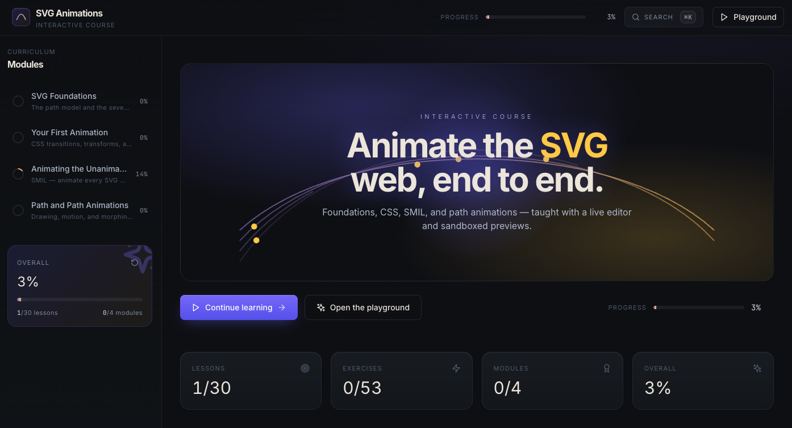

# Complete SVG Animations

*Master the art of creating dynamic, interactive SVG animations from foundations to advanced techniques*

[](https://github.com/your-username/complete-svg-animations)
[](LICENSE)



---

## 🎯 Course Overview

This comprehensive interactive course teaches you everything you need to know about creating stunning SVG animations. From basic shapes to complex path animations, you'll learn both CSS and SMIL techniques to bring your graphics to life.

**Course Duration:** 4 Modules  
**Skill Level:** Beginner to Advanced  
**Prerequisites:** Basic HTML and CSS knowledge  
**Technology Stack:** React, TypeScript, MDX, Tailwind CSS

---

## 🚀 Getting Started

### Prerequisites
- Node.js (v16 or higher)
- npm, yarn, or pnpm

### Installation
```bash
# Clone the repository
git clone https://github.com/devmahmud/complete-svg-animations.git
cd complete-svg-animations

# Install dependencies
npm install
# or
yarn install
# or
pnpm install

# Start the development server
npm run dev
# or
yarn dev
# or
pnpm dev
```

The application will be available at `http://localhost:5173`

---

## 📚 Course Structure

### Module 1: SVG Foundations
**Path:** `src/content/module-1/`

**What you'll learn:**
- Introduction to SVGs and their fundamentals
- The seven primitive shapes (rect, circle, ellipse, line, polyline, polygon, path)
- How shapes are constructed and coordinate systems
- Styling attributes and grouping elements
- Practice exercises with real-world examples

**Key Concepts:**
- SVG path model vs box model
- Responsive SVG design
- Shape construction principles
- Coordinate system fundamentals

---

### Module 2: Your First Animation
**Path:** `src/content/module-2/`

**What you'll learn:**
- Introduction to SVG animations
- CSS transitions and transforms
- Animation sequencing and timing functions
- Transform origins and complex animations
- Building animated UI components

**Key Concepts:**
- CSS animation capabilities and limitations
- Timing functions and easing
- Animation orchestration
- Interactive design patterns

---

### Module 3: Animating the Unanimatable
**Path:** `src/content/module-3/`

**What you'll learn:**
- The limitations of CSS animations
- SMIL (SVG's native animation system)
- Deep dive into SMIL capabilities
- SMIL timing functions and orchestration
- SMIL integration with React
- Advanced SMIL projects

**Key Concepts:**
- SMIL vs CSS limitations
- Path data animation
- Complex attribute animation
- Event-based animations

---

### Module 4: Path and Path Animations
**Path:** `src/content/module-4/`

**What you'll learn:**
- The path element and its power
- Advanced path commands and techniques
- Drawing animations with stroke-dasharray
- Motion along paths with animateMotion
- Path morphing and complex transitions
- Real-world project implementations

**Key Concepts:**
- Path command mastery
- Drawing animation techniques
- Motion path following
- Advanced path manipulation

---

## 🎮 Interactive Features

### Code Playground
- **Location:** `/playground` route
- **Features:**
  - Real-time SVG code editing
  - Multiple animation templates
  - Live preview of animations
  - Code download and sharing
  - Template categories: Basic Shapes, CSS Animation, SMIL Animation, Path Animation, Complex Animation

### Interactive Course Content
- **MDX-based content** with embedded code examples
- **Syntax highlighting** for SVG and CSS code
- **Responsive design** for all devices
- **Navigation sidebar** with course structure
- **Progress tracking** through modules

---

## 🛠️ Technology Stack

### Frontend
- **React 18** - UI framework
- **TypeScript** - Type safety
- **React Router** - Navigation
- **Framer Motion** - Page transitions and animations
- **Tailwind CSS** - Styling
- **Lucide React** - Icons

### Content
- **MDX** - Markdown with JSX support
- **Prism.js** - Syntax highlighting
- **Monaco Editor** - Code editing in playground

### Build Tools
- **Vite** - Build tool and dev server
- **PostCSS** - CSS processing
- **Autoprefixer** - CSS vendor prefixes

---

## 📁 Project Structure

```
complete-svg-animations/
├── src/
│   ├── components/          # React components
│   │   ├── CodePlayground.tsx
│   │   ├── Header.tsx
│   │   ├── MarkdownContent.tsx
│   │   └── Sidebar.tsx
│   ├── content/            # Course content (MDX files)
│   │   ├── module-1/       # SVG Foundations
│   │   ├── module-2/       # Your First Animation
│   │   ├── module-3/       # Animating the Unanimatable
│   │   └── module-4/       # Path and Path Animations
│   ├── context/            # React context
│   │   └── CourseContext.tsx
│   ├── pages/              # Page components
│   │   ├── Dashboard.tsx
│   │   ├── ModuleView.tsx
│   │   └── Playground.tsx
│   ├── App.tsx             # Main app component
│   └── index.tsx           # Entry point
├── public/                 # Static assets
├── package.json            # Dependencies and scripts
└── README.md              # This file
```

---

## 🚀 Learning Path

### For Beginners
1. Start with **Module 1** to understand SVG fundamentals
2. Move to **Module 2** for basic CSS animations
3. Practice with the interactive playground
4. Build simple interactive components

### For Intermediate Developers
1. Review **Module 1** for foundational concepts
2. Master **Module 2** CSS animations
3. Dive into **Module 3** SMIL techniques
4. Explore **Module 4** advanced path animations
5. Combine techniques for complex projects

### For Advanced Developers
1. Focus on **Module 3** and **Module 4**
2. Master SMIL orchestration
3. Create complex path morphing animations
4. Build production-ready animated components
5. Optimize for performance

---

## 🎨 Course Projects

### Beginner Projects
- Animated icon set with hover effects
- Simple loading spinners
- Interactive buttons with SVG icons
- Basic shape morphing animations

### Intermediate Projects
- Complex loading animations
- Interactive data visualizations
- Animated logos and branding
- Path-based drawing animations

### Advanced Projects
- Complex path morphing systems
- Interactive maps with animations
- Advanced data flow visualizations
- Production-ready animated components

---

## ⚡ Best Practices

### Performance
- Use `transform` instead of changing position attributes
- Optimize SVG files with SVGO
- Limit the number of simultaneous animations
- Use `will-change` CSS property for performance hints

### Accessibility
- Provide alternative text for animated SVGs
- Ensure animations don't cause motion sickness
- Use `prefers-reduced-motion` media query
- Test with screen readers

### Browser Compatibility
- Test across different browsers
- Provide fallbacks for older browsers
- Use feature detection for advanced features
- Consider polyfills for SMIL support

---

## 🔧 Common Challenges and Solutions

### Challenge: Complex Path Animations
**Solution:** Break down complex paths into simpler segments and animate them sequentially.

### Challenge: Performance Issues
**Solution:** Use CSS transforms, optimize SVG files, and limit concurrent animations.

### Challenge: Browser Compatibility
**Solution:** Use feature detection and provide fallbacks for unsupported features.

### Challenge: Complex Timing
**Solution:** Use SMIL's `begin` attribute and event-based triggers for precise control.

---

## 🛠️ Development

### Available Scripts
```bash
# Start development server
npm run dev

# Build for production
npm run build

# Preview production build
npm run preview
```

### Adding New Content
1. Create new MDX files in the appropriate module directory
2. Update the module's `index.mdx` file with the new content
3. The content will automatically be available in the course

---

## 🤝 Contributing

This course is designed to be a comprehensive resource for learning SVG animations. If you find any issues or have suggestions for improvements, please feel free to contribute!

### How to Contribute
1. Fork the repository
2. Create a feature branch
3. Make your changes
4. Submit a pull request

---

## 📄 License

This course is licensed under the MIT License - see the [LICENSE](LICENSE) file for details.

---

## 🙏 Acknowledgments

- MDN Web Docs for comprehensive SVG documentation
- The SVG community for continuous innovation
- All contributors who helped improve this course

---

## 📞 Support

If you have questions or need help with the course content:

- Create an issue in this repository
- Check the course modules for detailed explanations
- Use the interactive playground to experiment with code

---

**Happy Learning! 🎉**

*Start your journey into the world of SVG animations with Module 1: Foundations* 